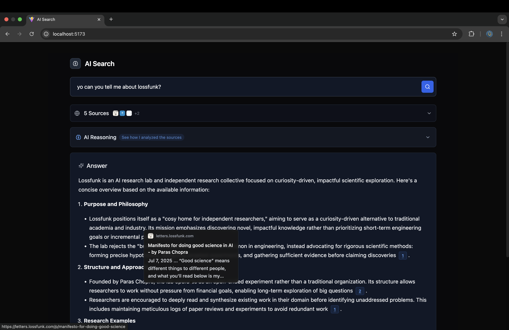

# AI Search

This is a fairly simple project that was inspired by [Perplexity](https://perplexity.ai). It uses [llama-3.3-70b-versatile](https://github.com/meta-llama/llama-models/blob/main/models/llama3_3/MODEL_CARD.md) (hosted on [Groq](https://console.groq.com/docs/models)) and [Google Custom Search JSON API](https://developers.google.com/custom-search/v1/overview).

## Tech Stack

### Backend

- Node.js
- Express.js
- No TypeScript (yet)

### Frontend

- React
- TypeScript
- Tailwind CSS (& CSS)

## Development

1. Clone the repo.
2. Make sure Node.js is installed. I've tested with `v22`.
3. Run `npm install` in both _backend_ and _frontend_ subdirs.
4. Create a `.env` file in _backend_. Check _backend/src/env.js_ for variables. Also make sure to set `PORT` to 8080.
5. Run `npm run dev` in both subdirs.

## Acknowledgements

1. [Perplexity](https://perplexity.ai) for inspiration
2. [Meta](https://meta.com/) for [Llama](https://github.com/meta-llama/llama-models/blob/main/models/llama3_3/MODEL_CARD.md)
3. [Groq](https://groq.com/) for inference
4. [Google](https://developers.google.com/custom-search/v1/overview) for data
5. [bolt](https://bolt.new) and [v0](https://v0.dev) for frontend
6. [Claude](https://claude.ai/) for helping me with prompts
7. And [ChatGPT](https://chatgpt.com/) of course
